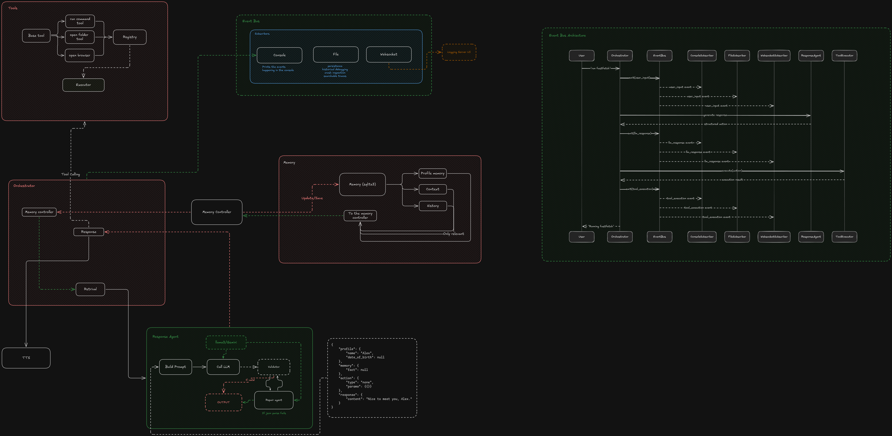

# Sam

> A voice-first assistant that listens, remembers, reasons with a local LLM, and acts through approved tools.




Sam is built as a compact but expressive assistant stack. It captures speech, builds context from memory, asks Ollama for a strict JSON response, validates the result, executes a tool when needed, and speaks the answer back out loud.

## Highlights

- Voice input and speech output for a hands-free workflow
- Local LLM orchestration with structured JSON responses
- Short-term history plus lightweight long-term memory in SQLite
- Safe tool execution for browser, search, folders, and approved terminal commands
- Rich observability through console, file, and websocket event streams
- Prompt examples and schemas that keep behavior predictable

## Tech Stack

| Layer | Tools |
| --- | --- |
| Language | Python 3.13 |
| LLM runtime | Ollama |
| Speech-to-text | `faster-whisper`, `sounddevice`, `scipy` |
| Text-to-speech | `pyttsx3` |
| Validation | `pydantic` |
| API and logging | `FastAPI`, `uvicorn`, `websockets`, `rich` |
| Storage | SQLite |
| Config and prompts | `python-dotenv`, `pyyaml` |

## What Sam Can Do

- Open a website in your default browser
- Search the web from a spoken request
- Open common folders like Downloads, Documents, and Projects
- Run a small allowlist of safe terminal commands
- Remember profile details such as a name or date of birth
- Store recent conversation history and a few long-term memories

## How It Works

1. `main.py` starts observability, greets the user, and enters the voice loop.
2. `src/voice/voice.py` records audio, transcribes speech, and speaks responses.
3. `src/orchestrator/orchestrator.py` stores user input, builds context, and coordinates the pipeline.
4. `src/agents/response_agent.py` loads prompt data, calls Ollama, and validates the JSON response.
5. `src/tools/executor.py` runs the requested tool through the registry.
6. `src/memory/memory_store.py` persists profile data, history, and memories in SQLite.
7. `src/observability/` broadcasts structured events to the console, `logs/events.log`, and the websocket server.

## Project Structure

```text
.
├── README.md
├── main.py
├── pyproject.toml
├── uv.lock
├── docs/
│   └── Sam.png
├── examples/
│   ├── example_history.json
│   └── example_output.json
├── logs/
├── models/
│   ├── vosk-model-small-en-us-0.15/
│   └── vosk-model-small-en-us-0.15.zip
├── src/
│   ├── agents/
│   ├── config/
│   ├── memory/
│   ├── observability/
│   ├── orchestrator/
│   ├── prompts/
│   ├── schema/
│   ├── tools/
│   └── voice/
├── test.py
└── memory.db
```

## Getting Started

### Requirements

- Python 3.13
- Ollama installed locally
- A pulled model available to Ollama, usually `llama3`
- A working microphone and speakers
- Linux desktop helpers for opening folders and terminals
  - `xdg-open`
  - `kitty`

### Install

Using `uv`:

```bash
uv sync
```

If you ever need to refresh dependencies, run:

```bash
uv sync --refresh
```

### Run

With `uv`:

```bash
uv run main.py
```

If you already have the environment active:

```bash
python main.py
```

Say anything to talk to Sam. Say `exit` to quit.

## Configuration

- Place local secrets in `.env` if needed
- `test.py` expects `GEMINI_API_KEY` if you want to run that script
- The bundled Vosk model lives at `models/vosk-model-small-en-us-0.15/`
- Runtime data such as `memory.db` and `logs/events.log` can be regenerated
- Dependency changes should be followed by `uv sync`

## Observability

Sam emits structured events during almost every step of the pipeline.

- Console events are rendered with `rich`
- File events are appended to `logs/events.log`
- Websocket clients can subscribe at `ws://127.0.0.1:8001/logs`

## Contributing

Contributions are welcome. If you want to improve Sam, here is a clean workflow:

1. Fork or branch from the current codebase.
2. Make your change in a focused area.
3. Keep tool behavior safe and explicit.
4. Update prompts, examples, or schema definitions when behavior changes.
5. Verify the app still runs from `python main.py`.
6. Keep the README and docs in sync with any structural changes.

### Good Places To Contribute

- Better prompt design
- More tools with safe parameter validation
- Improved memory and profile handling
- UI and observability polish
- Tests and reliability hardening

## Notes

- The assistant currently uses Ollama directly from `src/agents/response_agent.py`
- The default model is `llama3`
- Tool execution is intentionally conservative
- The architecture diagram in `docs/Sam.png` shows the end-to-end event flow
